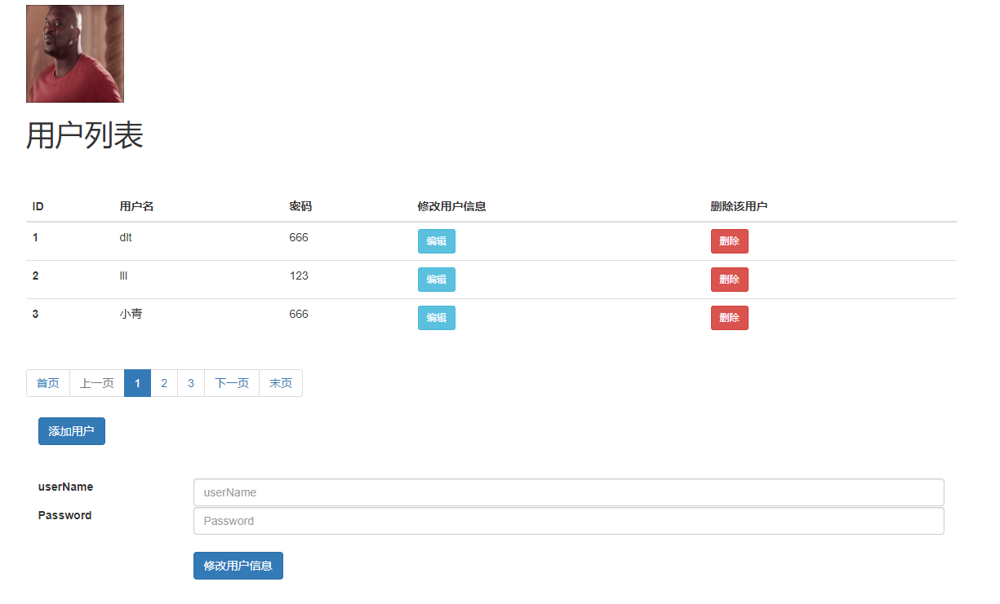

# Springboot crud基本框架

初学Springboot，自己搭建了一个基本的增删改查框架，作为之后项目的基本架构和参考。用到的技术主要是Springboot+mybatis，
使用pageHelper进行分页，前端用到了Vue的动态绑定。
## 主要功能
1. 主页列表展示所有用户，并提供分页功能。
2. 每条用户记录可进行编辑或修改。
3. 新增用户。
4. 提供mybatis-generator自动生成代码工具。
## 前端技术
* Vue
* jQuery
* ajax
* thymeleaf
* bootstrap
## 后端技术
* Springboot
* mybatis
* mybatis-generator
* PageHelper
## 界面预览

